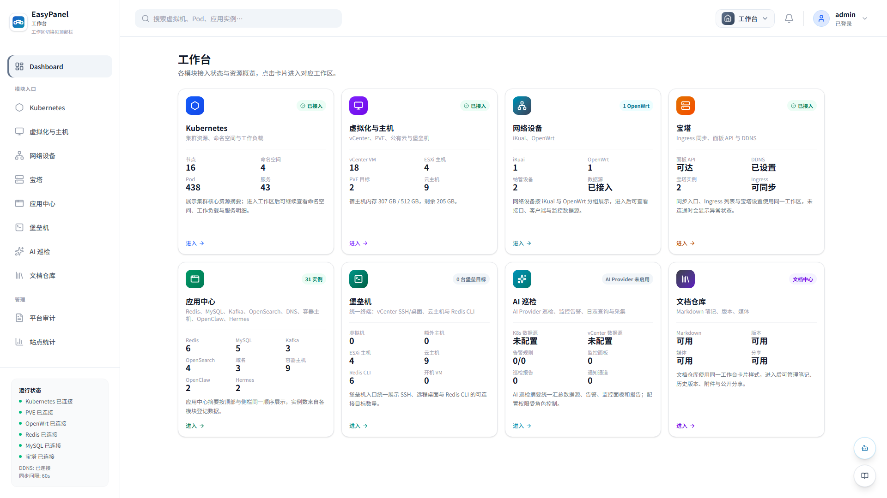
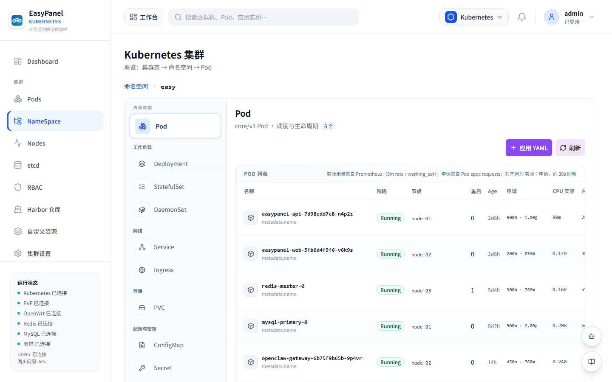
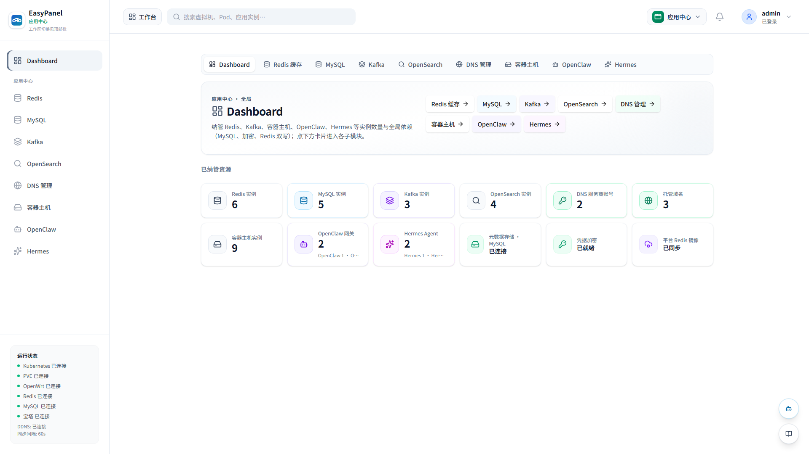
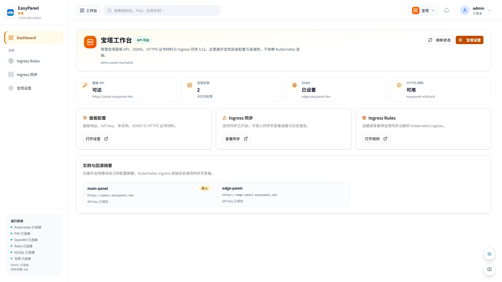
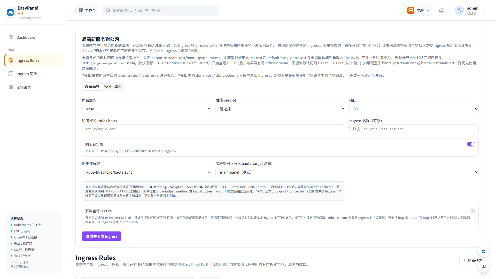
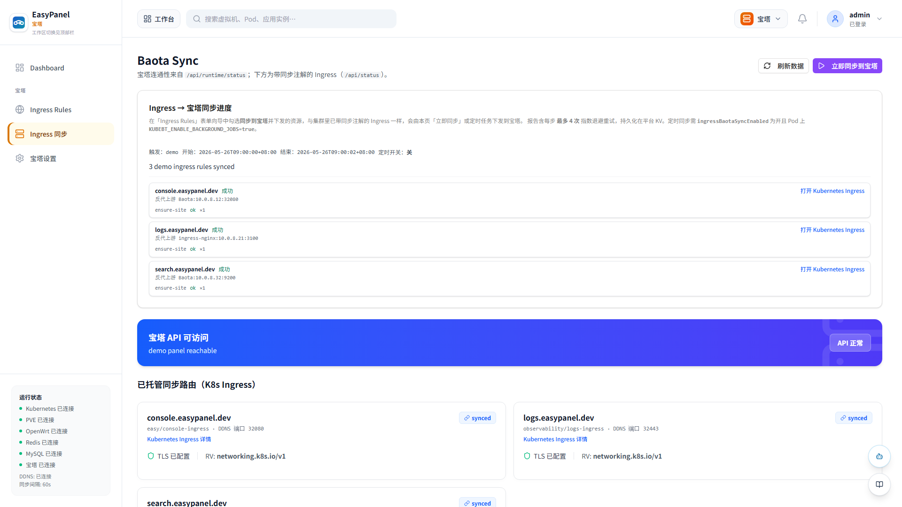
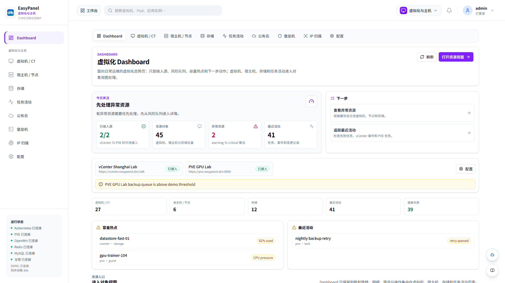
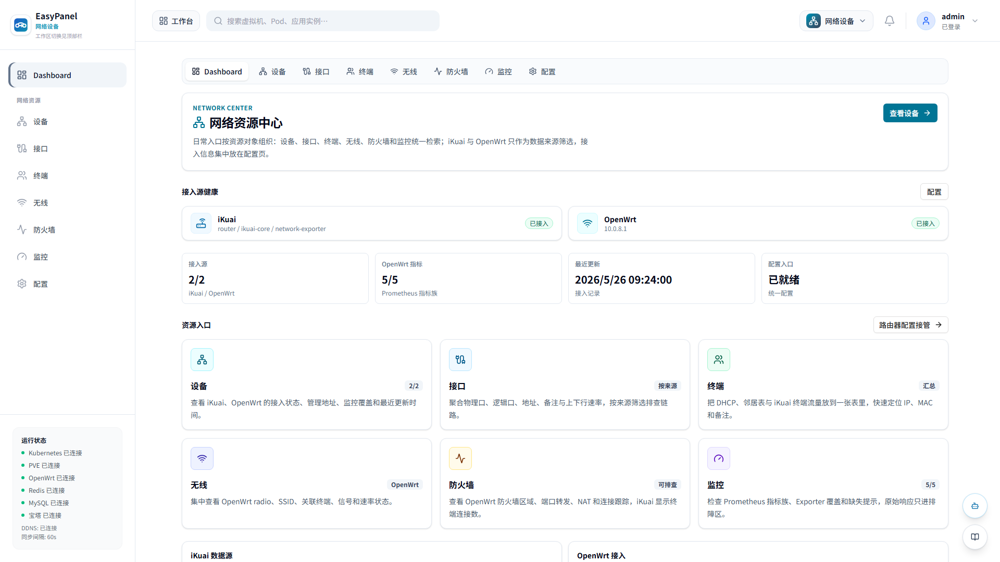

# EasyPanel

EasyPanel 是面向自建 Kubernetes、Homelab 与小型私有云环境的运维控制台。它以 Go 后端和 React 前端组成，提供 Kubernetes 资源管理、Ingress 到宝塔面板的同步、应用中心、vCenter/云主机纳管、监控日志查询、文档中心与账号权限管理等能力。

当前仓库计划作为新项目发布到 `https://github.com/ops-easy/EasyPanel.git`。文档、部署清单和镜像发布流程均以这个新仓库作为默认上下文。



## 界面预览

以下截图由脚本启动真实 Vite 前端、在浏览器测试上下文中 mock `/api/*` 演示数据后截取，统一使用 1920x1080 视口，不包含真实基础设施、账号或业务信息。

| Kubernetes 资源中心 | 应用中心 |
| --- | --- |
|  |  |

| 宝塔工作台 | Ingress Rules |
| --- | --- |
|  |  |

| Ingress 同步详情 | 虚拟化资源 |
| --- | --- |
|  |  |

| 网络资源中心 |
| --- |
|  |

## 演示数据

演示截图使用 [自动生成演示数据](./docs/demo/demo-data.json) 生成，覆盖集群、命名空间、应用实例、Ingress、告警和审计记录等典型场景。需要刷新截图时可运行：

```bash
node scripts/generate-demo-assets.mjs
```

## 核心能力

| 模块 | 说明 |
| --- | --- |
| 工作台 | 汇总平台状态，并在 Kubernetes、宝塔、应用中心、vCenter、堡垒机、巡检、文档等工作区之间切换 |
| Kubernetes | 查看命名空间、Pods、Nodes、Services、Ingresses、Workloads、PVC、ConfigMap、Secret、RBAC、CRD；支持日志、终端、YAML 与图形化编辑 |
| Ingress 同步 | 监听带注解的 Ingress，将域名与上游规则同步到宝塔 Nginx，支持 HTTPS 证书配置 |
| 应用中心 | 管理 Redis、Kafka、OpenSearch、Cloud VM、OpenClaw、DNS 等实例和模板 |
| vCenter 与堡垒机 | 纳管 vSphere 虚拟机、ESXi 主机、WebMKS 控制台、SSH/SFTP、云主机和来宾性能数据 |
| 监控与日志 | 对接 Prometheus、VictoriaMetrics、VictoriaLogs、Harbor、企业微信告警、巡检报告和全局 AI 对话 |
| 文档中心 | 内置 Markdown 编辑器、附件上传、公开分享页面、Excalidraw 白板和 CDN 静态资源配置 |
| 账号与安全 | 本地账号、TOTP、OIDC、角色权限、审计日志、访问统计和平台外观配置 |

## 技术栈

后端：

- Go 1.25.6
- Gin
- Kubernetes client-go
- MySQL、Redis
- govmomi
- franz-go
- Gorilla WebSocket

前端：

- React 19
- TypeScript
- Vite 7
- Tailwind CSS v4
- Radix UI / shadcn 风格组件
- TanStack Query
- React Router
- XTerm.js、Recharts、ByteMD、Excalidraw

## 项目结构

```text
EasyPanel/
├── backend/                         # Go 后端，入口为 backend/main.go
├── frontend/                         # React + Vite 前端
├── k8s/backend/                 # 后端 Kubernetes 清单
├── k8s/frontend/                # 前端 Kubernetes 清单
├── k8s/charts/easypanel/          # Helm Chart
├── docs/                        # 运维说明文档
├── .github/workflows/           # CI、GHCR 镜像发布与远端烟测工作流
└── makefile                     # 常用本地开发命令
```

## 快速开始

### 本地开发

准备：

- Go 1.25.6 或兼容版本
- Node.js 20+ 与 npm
- 可选：kubectl、Helm、Docker

先复制示例配置，再按本地环境修改后端配置。`backend/config.yaml` 可能包含数据库密码和会话密钥，默认不会提交到 Git：

```bash
cp backend/config.example.yaml backend/config.yaml
vim backend/config.yaml
```

启动后端：

```bash
make start-backend
```

启动前端：

```bash
make start-frontend
```

常用检查：

```bash
cd backend && go test ./...
cd frontend && npm run check
```

CI 会在 PR 以及 `main` / `master` 推送时运行后端测试、前端总检查、bundle 预算、API 契约、文本编码和 dist 烟测；镜像发布工作流复用同一套前端检查后再构建 GHCR 镜像。

构建产物与已部署环境的烟测：

```bash
cd frontend
npm run build
npm run smoke:dist
SMOKE_BASE_URL=https://your-staging.example.com npm run smoke:deploy
SMOKE_BASE_URL=https://your-staging.example.com SMOKE_D_PATH=/d/ npm run smoke:deploy
SMOKE_BASE_URL=https://your-staging.example.com SMOKE_READONLY_READINESS=1 npm run smoke:deploy
SMOKE_BASE_URL=https://your-staging.example.com npm run smoke:deploy:readiness
npm run smoke:deploy:readiness -- --base-url https://your-staging.example.com
SMOKE_BASE_URL=https://your-staging.example.com npm run smoke:readonly-readiness
```

`smoke:deploy` 默认仍只做部署安全的远端 SPA、资源和公开接口检查；本地 `npm run check` 只调用 `check:deploy` 的 dist/nginx 合约，不会触发真实环境只读探针。要在 staging 或真实已连接环境里把只读 readiness 一起纳入部署验收，可设置 `SMOKE_READONLY_READINESS=1` 后运行 `smoke:deploy`，或直接运行组合入口 `smoke:deploy:readiness`。组合入口支持 `SMOKE_BASE_URL`，也支持 npm 透传的 `--base-url`；使用 `--base-url` 时，`smoke:deploy` 会把同一个地址写入 `SMOKE_BASE_URL` 后再动态导入只读 readiness 脚本，确保两个阶段检查同一个目标环境。`smoke:readonly-readiness` 也保留为单独预设：它只发起 `GET` 请求，复用 `EASYPANEL_RENDER_SMOKE_ROUTE` 的路由过滤语义，默认检查 `/login`、`/`、`/cluster/compute/dashboard`、`/cluster/network/dashboard`、`/cluster/baota` 和 `/cluster/ai-inspect/dashboard`，并要求 vCenter、PVE、OpenWrt、iKuai、Prometheus、VictoriaLogs 的新探活状态为 `readonly_reachable`。

在 staging 上验证时先确保该环境已经连接对应数据源，再从 `frontend/` 目录执行上面的命令。脚本会检查 SPA 路由、构建资源、`/api/login/public-status` 的公开只读探针，以及带鉴权时的 `/api/runtime/status`；如果运行时状态接口需要登录，可设置 `SMOKE_AUTH_COOKIE` 或 `SMOKE_BEARER_TOKEN`，否则脚本会保留公开探针验证并提示跳过受保护接口。需要聚焦时可用 `EASYPANEL_RENDER_SMOKE_ROUTE=/cluster/ai-inspect/dashboard` 缩小路由集合，用 `SMOKE_READINESS_CHECKS=prometheus,victoriaLogs` 缩小只读探针集合，慢环境可调大 `SMOKE_REQUEST_TIMEOUT_MS`。

也可以在 GitHub Actions 手动运行 `.github/workflows/frontend-remote-smoke.yml`，传入 `base-url` 后由工作流在 `frontend/` 目录执行 `npm ci` 与 `npm run smoke:deploy:readiness -- --base-url "$REMOTE_SMOKE_BASE_URL"`；如目标环境需要登录，在仓库 Secrets 配置可选的 `SMOKE_AUTH_COOKIE` 或 `SMOKE_BEARER_TOKEN` 即可。

### Kustomize 部署

默认清单会创建 `easy` 命名空间、RBAC、PVC、后端 Deployment/Service、前端 Deployment/NodePort Service。

```bash
kubectl apply -k k8s
kubectl -n easy get pod,svc,pvc
```

前端 Service 默认暴露 NodePort `32080`：

```text
http://<任意节点 IP>:32080/setup
```

首次访问 `/setup` 完成初始化。生产环境建议再配置 Ingress 与 HTTPS：

```bash
kubectl apply -f k8s/frontend/ingress.yaml
```

### Helm 部署

```bash
helm install easypanel ./k8s/charts/easypanel \
  --namespace easy \
  --create-namespace \
  --set backend.image.repository=ghcr.io/ops-easy/easypanel-api \
  --set backend.image.tag=latest \
  --set frontend.image.repository=ghcr.io/ops-easy/easypanel-web \
  --set frontend.image.tag=latest
```

## 镜像发布

仓库包含 GitHub Actions 工作流 `.github/workflows/publish-images.yml`。推送到 `main` 或手动触发后，会发布：

- `ghcr.io/ops-easy/easypanel-api:latest`
- `ghcr.io/ops-easy/easypanel-api:<commit-sha>`
- `ghcr.io/ops-easy/easypanel-web:latest`
- `ghcr.io/ops-easy/easypanel-web:<commit-sha>`

后端镜像使用多阶段构建，最终运行镜像基于 `distroless/static-debian12:nonroot`，包含后端二进制与 `/app/helm`（用于容器内渲染 kube-prometheus-stack）；前端镜像基于 Nginx，并将 `/api/`、`/r/` 与公开媒体 `/d/` 反向代理到后端 Service。

预发或生产部署完成后，可手动触发 `.github/workflows/frontend-remote-smoke.yml`，输入部署后的 `base-url` 对远端前端入口和只读 readiness 探针做烟测。该工作流运行 `npm run smoke:deploy:readiness`，并会透传仓库 Secrets 中可选的 `SMOKE_AUTH_COOKIE` / `SMOKE_BEARER_TOKEN`。

## 关键配置

后端配置来源为静态配置 + MySQL 动态配置 + 环境变量；不再从磁盘读取 `runtime-config.json`，也不再使用 PVC 上的 `config.override.yaml`。静态配置默认是本地 `backend/config.yaml`，可从 `backend/config.example.yaml` 复制生成，也可用 `EASYPANEL_CONFIG_FILE` 指定其它路径；默认示例只保留 `server`、`db`、`redis`、`startup`、`performance` 这些启动必需配置。页面保存的业务配置写入 MySQL 表 `easypanel_platform_kv`，键为 `config_override_yaml_v1`。加载优先级为：程序默认值 < 静态配置 < MySQL 动态配置 < 环境变量。MySQL 连接属于启动依赖，必须放在静态 `config.yaml` 或环境变量中。常用变量如下：

| 变量 | 说明 |
| --- | --- |
| `DASHBOARD_HTTP_ADDR` | 后端监听地址，默认 `:8080` |
| `DASHBOARD_USER` / `DASHBOARD_PASSWORD` | 初始管理员账号和密码；仅在 MySQL 用户表为空时创建首个管理员，之后以数据库用户表为准 |
| `DASHBOARD_SESSION_SECRET` | 会话签名密钥，多副本部署必须固定一致 |
| `DASHBOARD_COOKIE_SECURE` | HTTPS 部署时建议设为 `true` |
| `DASHBOARD_SERVE_FRONTEND` | 是否由后端托管 React dist，默认 `false`；常规部署使用独立前端服务 |
| `DASHBOARD_TRUSTED_PROXIES` | 可信代理 CIDR，用于正确解析客户端 IP |
| `EASYPANEL_DATA_DIR` | 运行数据目录，Kubernetes 中默认挂载到 `/data` |
| `EASYPANEL_ENCRYPTION_KEY` | SSH/SFTP 等敏感凭据的加密密钥 |
| `EASYPANEL_ENABLE_BACKGROUND_JOBS` | 是否启用后台同步、巡检和通知任务；多副本时仅保留一个副本为 `true` |
| `BAOTA_URL` / `BAOTA_API_KEY` | 宝塔面板 API 地址与密钥 |
| `INGRESS_BAOTA_SYNC_ENABLED` | 是否启用 Ingress 到宝塔的后台同步 |
| `DDNS_HOST` / `DEFAULT_PORT` | 宝塔反代默认回源到集群入口时使用的地址与 HTTP 端口 |
| `BAOTA_UPSTREAM_HOST` / `BAOTA_UPSTREAM_PORT` / `BAOTA_UPSTREAM_SCHEME` | 可选的固定回源覆盖；非空时优先于 `DDNS_HOST` / `DEFAULT_PORT` |
| `MYSQL_DSN` 或 `MYSQL_HOST` 系列 | MySQL 连接配置 |
| `REDIS_ADDR` / `REDIS_PASSWORD` | Redis 连接配置 |
| `PROMETHEUS_URL_K8S` / `VM_SELECT_URL_K8S` | Kubernetes 监控数据源 |
| `VICTORIA_LOGS_URL` | VictoriaLogs 查询地址 |
| `VCENTER_URL` / `VCENTER_USER` / `VCENTER_PASSWORD` | vCenter 连接配置 |
| `HARBOR_BASE_URL` / `HARBOR_USERNAME` / `HARBOR_PASSWORD` | Harbor API 配置 |
| `OIDC_ISSUER_URL` 等 | OIDC 登录配置 |
| `EASYPANEL_ASSETS_CDN_BASE` | 文档公开页静态资源 CDN 根地址 |

敏感配置请通过 Kubernetes `Secret`、CI Secret 或外部密钥系统注入，不要写入镜像和公开仓库。

## Ingress 同步注解

为需要同步到宝塔的 Ingress 添加注解：

```bash
kubectl annotate ingress <name> -n <namespace> easypanel.io/baota-sync="true"
```

### DDNS 回源与覆盖规则

`ddnsHost` 是宝塔反向代理访问集群入口时使用的主机名或节点 IP，不是业务域名 `rules.host`。通常填解析到公网入口节点的 DDNS 域名；没有 DDNS 时也可以填固定公网 IP、内网穿透域名或边缘节点地址。

默认：HTTP + DEFAULT_PORT。也就是宝塔默认回源到 `http://<ddnsHost>:<DEFAULT_PORT>`，这里的 `DEFAULT_PORT` 通常对应 ingress-nginx 在节点上监听的 HTTP 端口。若配置了 `BAOTA_UPSTREAM_HOST`、`BAOTA_UPSTREAM_PORT` 或 `BAOTA_UPSTREAM_SCHEME`，宝塔设置里的固定回源优先。

开启宝塔 HTTPS 后，`easypanel.io/baota-https: "true"` 会让宝塔侧启用 HTTPS；如果没有额外写 `ddns-scheme`，回源协议会默认切到 HTTPS，并使用 `INGRESS_NGINX_HOST_HTTPS_PORT` / `HTTPS_PORT` 对应的 HTTPS 入口端口。HTTP 对外访问不会因为这个注解自动删除。

`ddns-port` 和 `ddns-scheme` 是为历史 YAML 与少数特殊服务保留的单条覆盖：它们只影响单条 Ingress 生成的宝塔反代，不会修改全局 `ddnsHost`、`DEFAULT_PORT` 或宝塔设置。常规场景优先在「宝塔设置」里维护全局回源，只有某个 Ingress 必须走不同端口或协议时才写这两个注解。

常用注解：

| 注解 | 说明 |
| --- | --- |
| `easypanel.io/baota-sync: "true"` | 标记为受管 Ingress |
| `easypanel.io/baota-https: "true"` | 在宝塔侧启用 HTTPS |
| `easypanel.io/baota-ssl-cert-name: "<cert>"` | 指定宝塔证书名称 |
| `easypanel.io/ddns-scheme: "http\|https"` | 覆盖单条 Ingress 的宝塔回源协议 |
| `easypanel.io/ddns-port: "<port>"` | 覆盖单条 Ingress 的宝塔回源端口 |
| `i4t.com/baota-sync: "true"` | 旧版兼容注解 |

示例：

```yaml
metadata:
  annotations:
    easypanel.io/baota-sync: "true"
    easypanel.io/baota-https: "true"
    easypanel.io/baota-ssl-cert-name: "example-cert"
    # 可选：只影响单条 Ingress
    # easypanel.io/ddns-scheme: "https"
    # easypanel.io/ddns-port: "30443"
```

## 数据持久化

| 数据 | 推荐位置 |
| --- | --- |
| 静态后端配置 | `backend/config.yaml`、Kubernetes ConfigMap 或环境变量 |
| 页面动态业务配置 | MySQL 表 `easypanel_platform_kv`，键 `config_override_yaml_v1` |
| 平台 KV | MySQL；单机调试可回退文件，Redis 仅做热读或兼容镜像 |
| 用户、审计、应用实例、文档索引 | MySQL |
| 文档附件 | 本地 `/data/doc-uploads` 或腾讯云 COS |
| SSH/SFTP 凭据 | `/data/ssh-settings`，配合 `EASYPANEL_ENCRYPTION_KEY` 加密 |

多副本部署建议使用 MySQL 保存平台核心状态，并固定 `DASHBOARD_SESSION_SECRET` 与 `EASYPANEL_ENCRYPTION_KEY`。

## 文档索引

- [Kubernetes 部署说明](./k8s/README.md)
- [演示数据与截图](./docs/demo/README.md)
- [MetalLB 与 ingress-nginx 说明](./docs/kubernetes-metallb-ingress-nginx.md)
- [Kubernetes Dashboard 与 Prometheus 对接](./docs/kubernetes-dashboard-prometheus.md)
- [全局 AI 对话助手](./docs/ai-chat-assistant.md)
- [文档公开页静态资源 CDN](./docs/external-assets-for-oss.md)
- [前端开发说明](./frontend/README.md)
- [Kafka 限速压测手册](./k8s/backend/kafka-throttle-perf.md)
- [贡献指南](./CONTRIBUTING.md)
- [安全策略](./SECURITY.md)
- [行为准则](./CODE_OF_CONDUCT.md)
- [项目来源与 NOTICE](./NOTICE)

## 作者微信

扫码添加作者微信。部署使用、运维交流、功能建议、PR 沟通或其他问题，都可以联系作者。


## 项目来源与许可证

EasyPanel 的早期项目来源为 abcdocker 的原始仓库：

https://github.com/abcdocker/kube-bt-sync

当前项目已经以 EasyPanel 的名称继续维护，并围绕 Kubernetes、应用中心、堡垒机、监控日志、文档中心和多模块运维控制台做了持续扩展。项目来源、版权说明和第三方依赖声明见 [NOTICE](./NOTICE)。

EasyPanel 以 [MIT License](./LICENSE) 开源发布。提交贡献即表示相关内容按 MIT License 授权；项目使用的 Go / npm 第三方依赖仍遵循各自的开源协议，依赖清单以 `backend/go.mod`、`backend/go.sum`、`frontend/package.json` 和 `frontend/package-lock.json` 为准。

## 免责声明

EasyPanel 面向自建基础设施与运维自动化场景。生产环境使用前，请结合你的网络边界、权限模型、密钥管理、审计要求和灾备策略完成安全评估。
